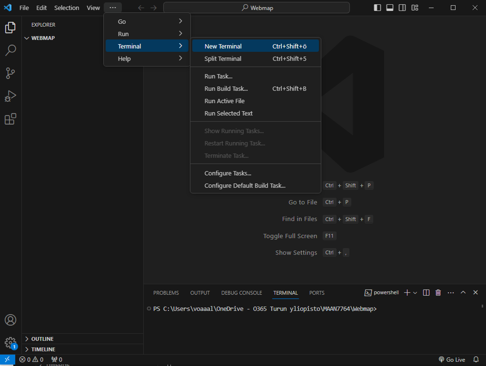

# OpenLayers webmap tutorial for MAAN7771 | 2025

This tutorial covers some key steps and tips for creating an OpenLayers webmap. The simple webmap created for this demo can be viewed here: [https://utu-geospatial-labs.github.io/MAAN7771-openlayers-tutorial/](https://utu-geospatial-labs.github.io/MAAN7771-openlayers-tutorial/).

## 1. Install software

Follow the OpenLayers [Quick Start guide](https://openlayers.org/doc/quickstart.html) to install correct versions of needed software: **Node.js**, **git**, and a **code editing software**, such as [Visual Studio Code](https://code.visualstudio.com/).


## 2. Initiate the editing environment

Create a new empty folder on your local computer where your webmap files will be created. 

Open your code editing software and open the empty folder in there. 

Follow the OpenLayers [Quick Start guide](https://openlayers.org/doc/quickstart.html) again:
  - Open a new terminal
  - Setup your new webmap project by running the commands:

`npm create ol-app my-app`\
`cd my-app`\
`npm start`



> [!NOTE]
> Note! In case you encounter some authorisation issues, try running this command:
`Set-ExecutionPolicy -Scope CurrentUser Unrestricted`, and after that retry with `npm start` (adapted from [Stack Overflow topic](https://stackoverflow.com/questions/79260111/npx-file-c-program-files-nodejs-npx-ps1-cannot-be-loaded-because-running-scri)).


## 3. Edit the webmap

This tutorial follows [Single Image WMS](https://openlayers.org/en/latest/examples/wms-image.html) example from OpenLayers repository. This example shows how to bring layers from Geoserver to your webmap.

Copy-and-paste the codes in the example files `index.html`, `main.js` and `package.json` to your corresponding files. Save the changes with CTRL+S. Open your locally hosted webmap by clicking the given URL in your terminal (e.g. http://localhost:5173). You should see the same webmap as in the example.


Do the following edits to the example code and save (CTRL+S):

### main.js

```javascript
new ImageLayer({
    extent: [3228700, -1381359, 4567834, -162868],
    source: new ImageWMS({
      url: 'https://geo-maa.utu.fi/geoserver/wms',
      params: {'LAYERS': 'tanzania:tanzania_forest_reserves_2020'},
      ratio: 1,
      serverType: 'geoserver',
    }),
  }),
```
Here, the 
- `extent` contains coordinates of the top-right and bottom-left corners of a bounding box that covers the whole country of Tanzania.
- `url` is changed to our course Geoserver
- `params` are changed to direct to Workspace called "tanzania" and a published layer called "tanzania_forest_reserves_2020"

```javascript
const map = new Map({
  layers: layers,
  target: 'map',
  view: new View({
    center: [3862074, -732904],
    zoom: 6,
  }),
});
```
Here, the
- `center` is changed to coordinates of a point in the middle of Tanzania
- `zoom` is changed slightly larger to get a closer view of Tanzania


### index.html

```html
    <style>
      .map {
        position: absolute;
        top: 0;
        left: 0;
        bottom: 0;
        right: 0;
      }
    </style>
```
Here, the size of the map window is changed to full screen.


### Adding a legend

The simple legend in this example webmap was added with the great [LayerSwitcher plugin](https://github.com/walkermatt/ol-layerswitcher?tab=readme-ov-file). Check the full codes at the end of this README to see the plugin in action. There are many other plugins as well that provide features for OpenLayers webmaps. Explore and try out!

Note that activating LayerSwitcher plugin functionalities require running `npm install ol-layerswitcher --save` command in your terminal. 


## 4. Publish on GitHub Pages

Following the OpenLayers [Quick Start guide](https://openlayers.org/doc/quickstart.html), final step would be to deploy your webmap with `npm run build` that creates a `dist/` folder where you have an `index.html` file and required assets to host and display your webmap online. However, as default the `<script src="...">` and `<link href="...">` paths in the `index.html` file are defined `/assets` which does not work in GitHub Pages. Instead, they should be defined `./assets`. This can be easily changed: 

### 1. Edit `vite.config.js` file
Should look like this:
```javascript
import { defineConfig } from 'vite';

export default defineConfig({
  base: './',
});
```

### 2. Rebuild your webmap app in terminal
`npm run build`

### 3. Rename your `dist` folder to `docs`
You may do this via terminal or manually in your file explorer.

### 4. Commit to GitHub
If not already, create a new repository in GitHub for your webmap. 

Upload or push the `docs` folder to the `main`branch.

### 5. Set up GitHub Page
Initiate GitHub Page for your repository:
- Settings --> Pages --> Build and deployment
  - Source: `Deploy from a branch`
  - Branch: `main`
  - Folder: `/docs`
 
Wait for the page to be built and once you get a URL, you are ready to see your webmap live!\


## Full code:

### main.js

```javascript
import 'ol/ol.css';
import 'ol-layerswitcher/dist/ol-layerswitcher.css';

import Map from 'ol/Map.js';
import View from 'ol/View.js';
import ImageLayer from 'ol/layer/Image.js';
import TileLayer from 'ol/layer/Tile.js';
import ImageWMS from 'ol/source/ImageWMS.js';
import OSM from 'ol/source/OSM.js';

import LayerSwitcher from 'ol-layerswitcher';


const layers = [
  new TileLayer({
    title: 'OpenStreetMap',
    type: 'base',
    source: new OSM(),
  }),

  new ImageLayer({
    title: 'Tanzania forest reserves',
    extent: [3228700, -1381359, 4567834, -162868],
    source: new ImageWMS({
      url: 'https://geo-maa.utu.fi/geoserver/wms',
      params: {'LAYERS': 'tanzania:tanzania_forest_reserves_2020'},
      ratio: 1,
      serverType: 'geoserver',
    }),
  }),
];
const map = new Map({
  layers: layers,
  target: 'map',
  view: new View({
    center: [3862074, -732904],
    zoom: 6,
  }),
});

const layerSwitcher = new LayerSwitcher({
  reverse: true,
  groupSelectStyle: 'group'
});
map.addControl(layerSwitcher);
```

### index.html
```html
<!DOCTYPE html>
<html lang="en">
  <head>
    <meta charset="UTF-8">
    <title>Single Image WMS</title>
    <link rel="stylesheet" href="node_modules/ol/ol.css">
    <style>
      .map {
        position: absolute;
        top: 0;
        left: 0;
        bottom: 0;
        right: 0;
      }
    </style>
  </head>
  <body>
    <div id="map" class="map"></div>

    <script type="module" src="main.js"></script>
  </body>
</html>
```

### package.json
```json
{
  "name": "my-app",
  "version": "1.0.0",
  "scripts": {
    "start": "vite",
    "build": "vite build",
    "serve": "vite preview"
  },
  "devDependencies": {
    "gh-pages": "^6.3.0",
    "vite": "^7.1.7"
  },
  "dependencies": {
    "ol": "10.6.1",
    "ol-layerswitcher": "^4.1.2"
  }
}
```

### style.css
```css
@import "node_modules/ol/ol.css";

html,
body {
  margin: 0;
  height: 100%;
}
```

### vite.config.js
```javascript
import { defineConfig } from 'vite';

export default defineConfig({
  base: './'
});
```


